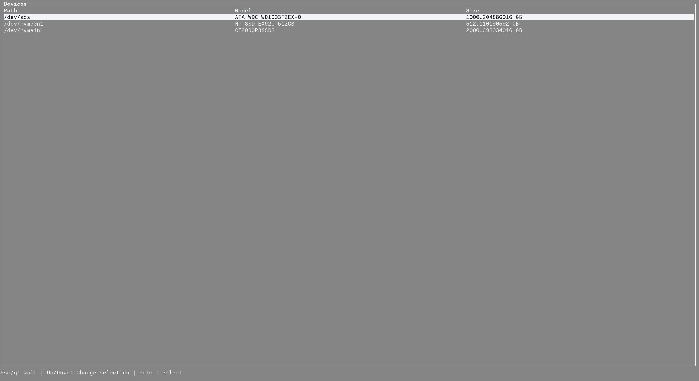
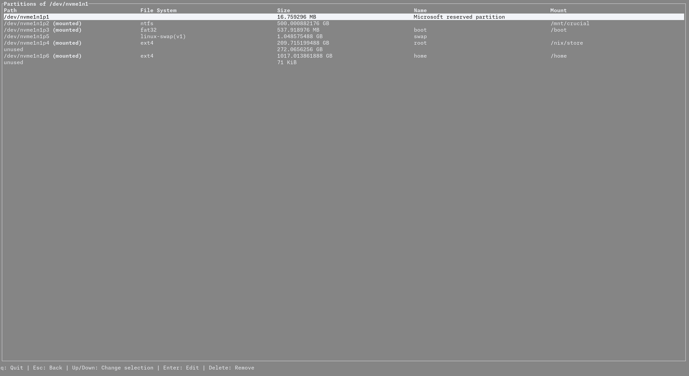

# Partner

A Linux disk partitioning library and TUI.

## Library

libpartner uses [libparted](https://docs.rs/libparted) under the hood, and is intended to be simpler and more convenient, with built-in support for undoing changes and owned types for partitions and disks.

## TUI

The partner TUI uses [ratatui](https://ratatui.rs) (and [ratatui-elm](https://docs.rs/ratatui-elm), made by me :3). It is fast, good-looking, and quick and easy to use.

### Usage

By default, partner will open to a list of all the devices it could discover. You can also pass in a device by path as a positional argument, in which case it will try to open to that device.

All keybinds are shown in the legend at the bottom of the screen.
